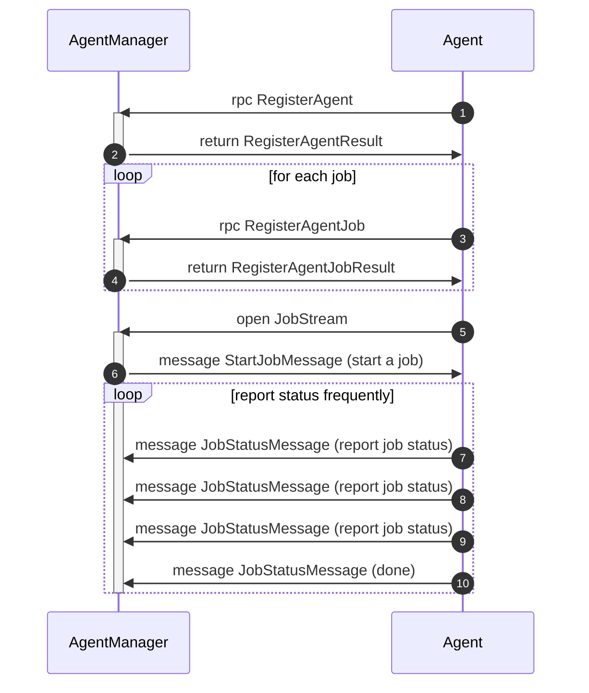
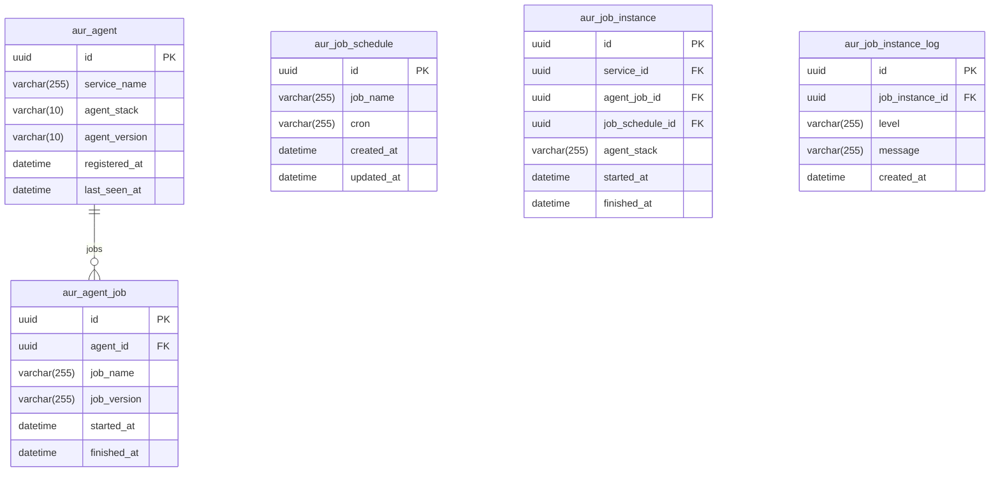

```mermaid
sequenceDiagram
  autonumber
  participant S as AgentManager
  participant A as Agent
  
  A->>S: rpc RegisterAgent
  activate S
  S->>A: return RegisterAgentResult
  deactivate S
  
  loop for each job
    A->>S: rpc RegisterAgentJob
    activate S
    S->>A: return RegisterAgentJobResult
    deactivate S
  end
  
  
  A->>S: open JobStream
  activate S
  S->>A: message StartJobMessage (start a job)
  loop report status frequently
    A->>S: message JobStatusMessage (report job status)
    A->>S: message JobStatusMessage (report job status)
    A->>S: message JobStatusMessage (report job status)
    A->>S: message JobStatusMessage (done)
  end
  deactivate S
  
```

## Data model

### Agents

```mermaid
erDiagram
  aur_agent {
    uuid id PK
    varchar(255) service_name
    varchar(10) agent_stack
    varchar(10) agent_version
    datetime registered_at
    datetime last_seen_at
  }
  
  aur_agent_job {
    uuid id PK
    uuid agent_id FK
    varchar(255) job_name
    varchar(255) job_version
    datetime started_at
    datetime finished_at
  }
  
  aur_job_schedule {
    uuid id PK
    varchar(255) job_name
    varchar(255) cron   
    datetime created_at
    datetime updated_at
  }
  
  aur_job_instance {
    uuid id PK
    uuid service_id FK
    uuid agent_job_id FK
    uuid job_schedule_id FK
    varchar(255) agent_stack
    datetime started_at
    datetime finished_at
  }
  
  aur_job_instance_log {
    uuid id PK
    uuid job_instance_id FK
    varchar(255) level
    varchar(255) message
    datetime created_at
  }
  
  aur_agent ||--o{ aur_agent_job : jobs
```

