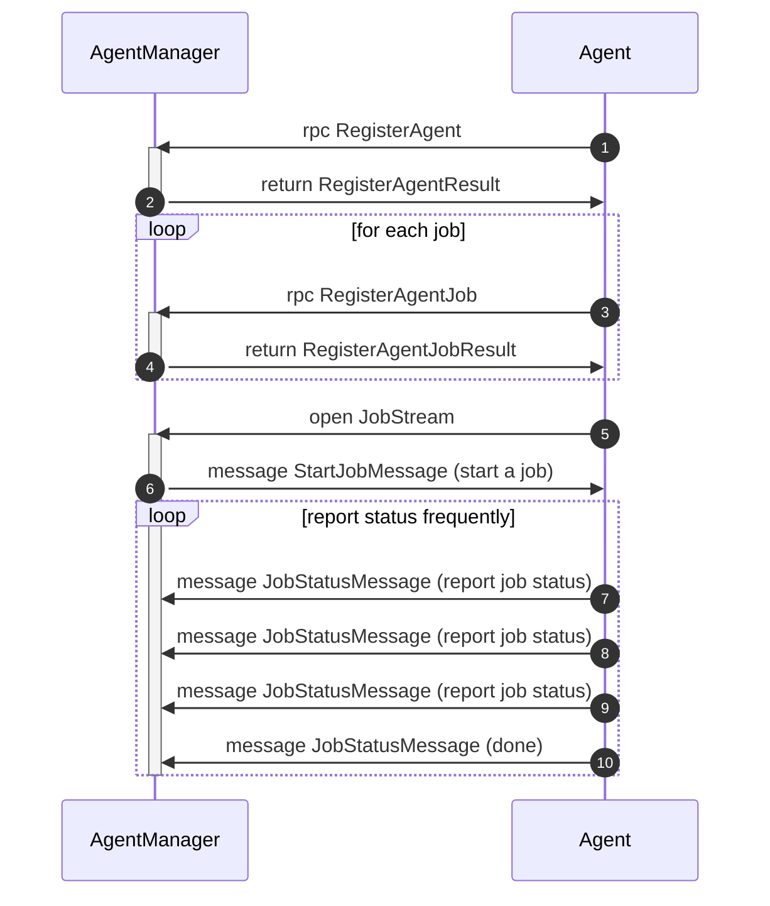

```mermaid
sequenceDiagram
  autonumber
  participant S as AgentManager
  participant A as Agent
  
  A->>S: rpc RegisterAgent
  activate S
  S->>A: return RegisterAgentResult
  deactivate S
  
  loop for each job
    A->>S: rpc RegisterAgentJob
    activate S
    S->>A: return RegisterAgentJobResult
    deactivate S
  end
  
  
  A->>S: open JobStream
  activate S
  S->>A: message StartJobMessage (start a job)
  loop report status frequently
    A->>S: message JobStatusMessage (report job status)
    A->>S: message JobStatusMessage (report job status)
    A->>S: message JobStatusMessage (report job status)
    A->>S: message JobStatusMessage (done)
  end
  deactivate S
  
```
